# Crud Tabla Ejercicios

Es un crud para la administracion de las tablas de ejericios y los usuario dados de alta.
La base de datos dispone de dos usuario para hacer pruebas el 'admin' con contraseña '1234' y el usuario normal
'Diego' '1234'

<a href="https://youtu.be/XD7eIDgcNJw" target="_blank">Video explicativo</a>

## Base de datos

La base de datos se compone de 4:
- ususrio: donde se almacenan los usuarios dados de alta
- tablaejercicio: donde se almacena las tablas de ejercicios
- dificultad: se usa para alimentar un desplegable a la hora de elegir el tipo de dificultad de la tabla de ejercicios
- usuario_has_tablaejercicio: se utiliza para relacionar las dos primeras tablas

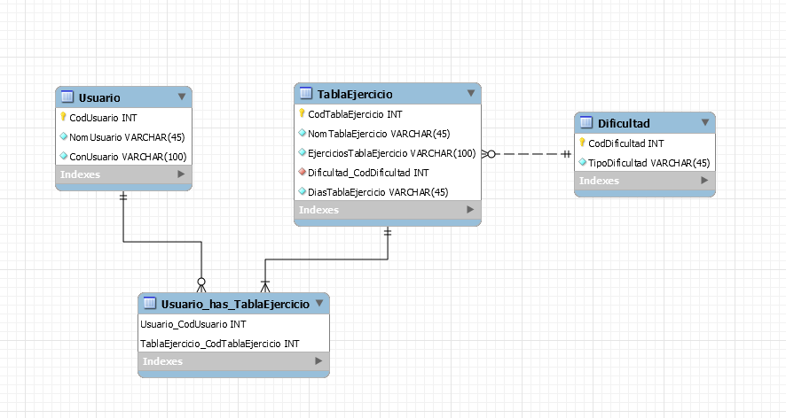

## 1 UsuarioNormal

### 1.1 Login_UsuarioNormal

Se nos mostrará un login.

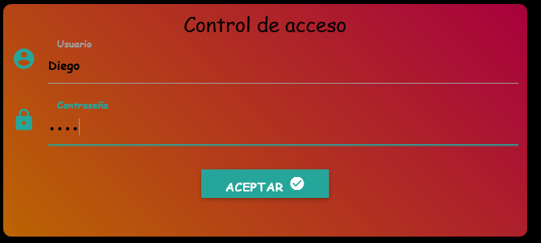
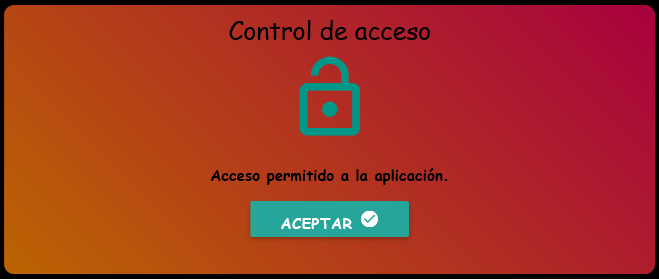

### 1.2 Lista_UsuarioNormal

Se nos mostrará una lista de todas las tablas que ha creado el usuario logueado con las opciones de añadir, eliminar y modificar.

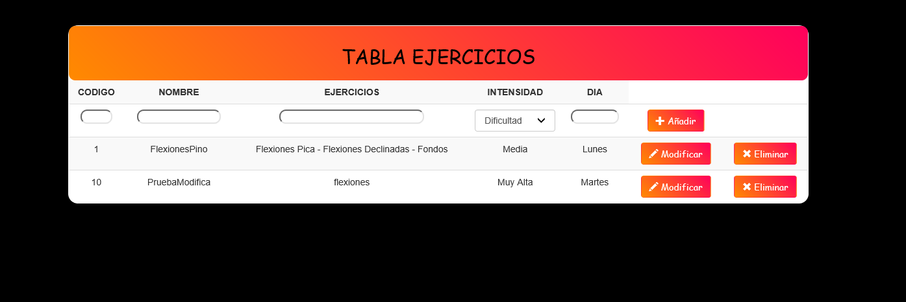

### 1.3 Añadir_TablaEjercicio

En la parte de arriba de la lista de tablas hay un pequeño formulario en el que añadiremos los datos de la tabla
de ejercicio que queremos dar de alta.

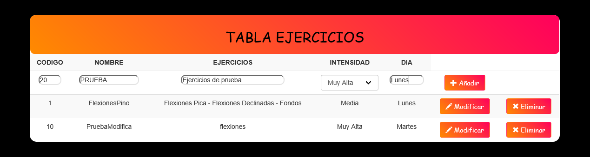

### 1.4 Modificar_Tabla

Se nos mostrará un formulario en el que introduciremos los datos que queremos modificar de la tabla selecionada.

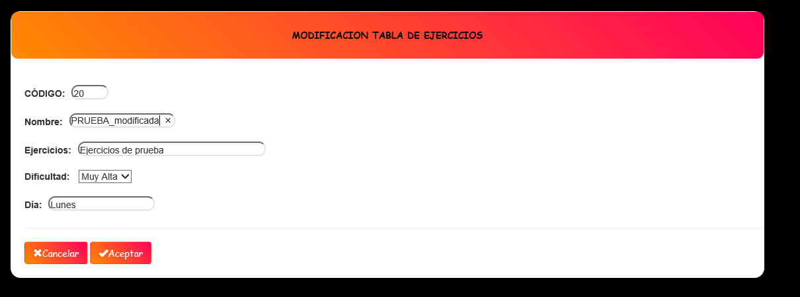

### 1.5 Eliminar_Tabla

Al pursal sobre eliminar se borrará la tabla seleccionada.

## 2 UsuarioAdmin

### 2.1 Login_UsuarioAdmin

Se nos mostrara un login

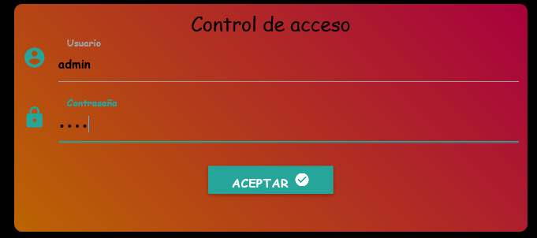
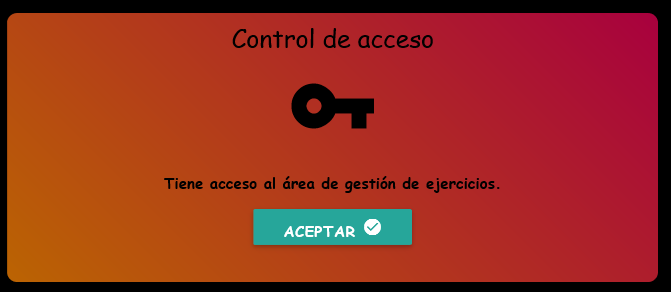

### 2.2 Lista_UsuarioAdmin

Se nos mostrará dos listas:
En una estarán todas las tablas que ha creado el usuario logueado (admin) con las opciones de añadir, eliminar y modificar al igual que cuado iniciaba un usuario normal.
En otra se mostrara una lista de todos los usuarios dados de alta donde se podran añadir y eliminar usuario

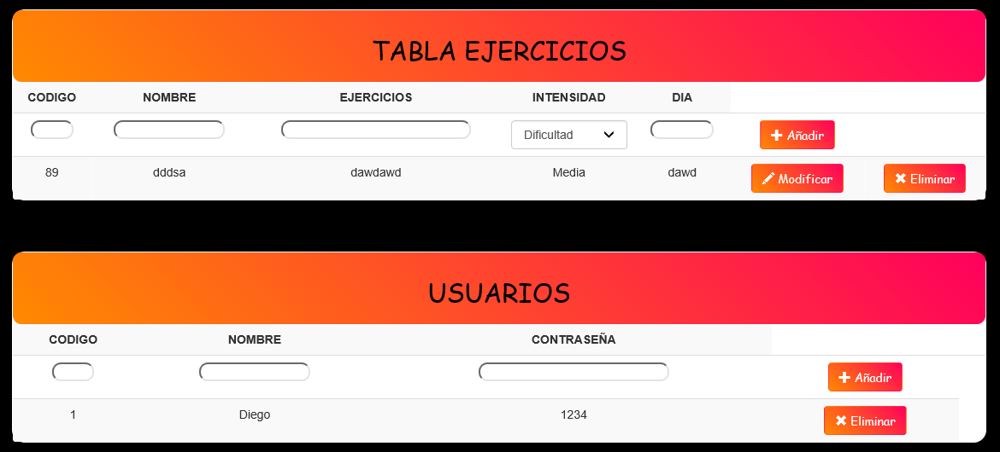

### 2.3 AñadirUsuario

En la parte superior de la lista de usuario dados de alta, habrá un pequeño formulario donde introduciremos los datos para crear el usurio, posteriormente se comprobará
que el codigo y nombre de usuario no está repetido y se dará de alta el usuario.

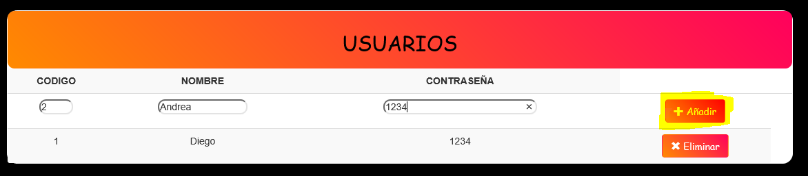

### 2.4 EliminaUsuario

A la izquierda de cada usurio hay un boton con el cual se podrá eliminar al usuario seleccionado.

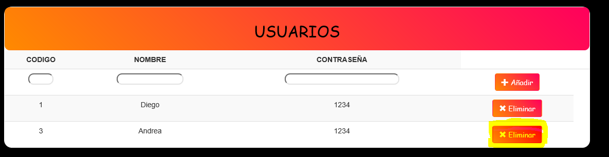

